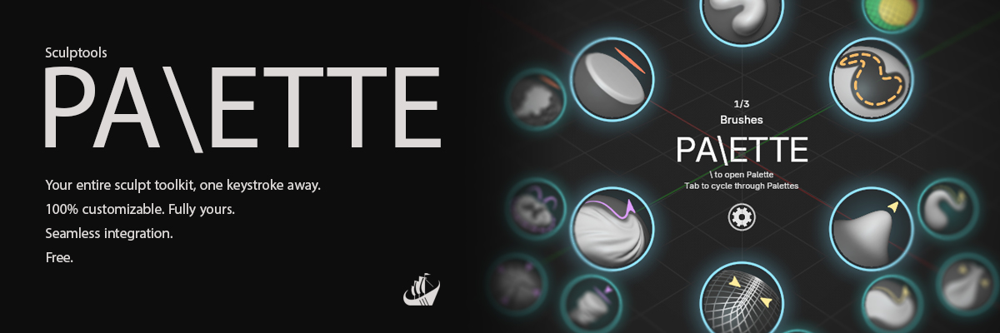

# Sculptools: Palette

**A radial (pie) menu that puts your favourite sculpt brushes _and_ tools one keystroke away.**

No more hunting through the Asset Libraries. Press one key in Blender's **Sculpt Mode** and a
palette of your hand-picked brushes and tools opens right under the cursor. Flick, click,
or tap a number to switch — then get back to sculpting.

**Find it useful?** Consider tipping at:

## Features

- **Radial Palette menu** — instant access to your brushes and tools in the same wheel.
- **Dynamic Brush Sliders** — right-click + drag to tune brush Radius and Strength.
- **Up to 8 palettes**, each with 10 main slots × 3 sub-slots — switch whole sets instantly.
- **Quick Numbers** — press a number key to activate a slot without opening the wheel.
- **Jump-to** — Ctrl + number key to jump immediately to the palette you need.
- **Import / Export presets** — backup your palettes and their look to a shareable file.
- **Seamless integration** — add brushes and tools from the shelf or using the radial menu.
- **Real thumbnails** — directly loaded from your own Asset libraries.
- **Fully configurable** — dedicated **N** panel visible in Sculpt Mode.

## Requirements

- **Blender 4.5 or newer** (installed as an Extension).

## Installation

**Drag & drop from the Blender Extensions Platform**

Drag the extension from [extensions.blender.org](https://extensions.blender.org)
straight onto a Blender window.

**or install from inside Blender**

Go to **Edit ▸ Preferences ▸ Get Extensions**, search for *Sculptools: Palette*,
and click **Install**.

## Quick start

1. Enter **Sculpt Mode** and press **`\`** — the wheel appears at your cursor.
2. Fill a slot: right-click a slot in the wheel and choose **Add Active Brush** or
   **Assign Tool ▸**. (You can also right-click a brush in the Asset Shelf →
   **Add brush to Palette**.)
3. **Hover** a slot to fan out its sub-slots, **click** to activate, or **flick** toward
   it to select instantly.
4. Press **N** in Sculpt Mode and open the **Palette** tab to change size, colours, slot
   count, hotkeys, and to import/export presets.

## Keyboard shortcuts

Enabling the add-on adds these bindings to Sculpt Mode. Every one can be rebound or
switched off from the **Palette** sidebar tab:

| Shortcut | Action |
| --- | --- |
| `\` (Backslash) | Open the radial palette |
| `Tab` / `Shift + Tab` | Cycle to next / previous palette |
| `Ctrl` + `1`–`8` | Jump directly to palette 1–8 |
| `1`–`9`, `0` | **Quick Numbers**: activate a slot's brush (repeat to cycle sub-slots) |
| Right-click + drag | **Dynamic Brush Sliders**: adjust brush Radius / Strength |

> **Note:** Quick Numbers and Dynamic Brush Sliders change how the number keys and the
> right mouse button behave in Sculpt Mode. Both are enabled by default and can be turned
> off at any time in the **Palette** sidebar tab. A quick right-click still opens Blender's
> native context menu.

## Licence

Released under the **GNU General Public License v3.0 or later** — see [LICENSE](LICENSE).

The bundled Sculpt tool icons are rasterised from Blender's own UI icon set
(© Blender Authors).
